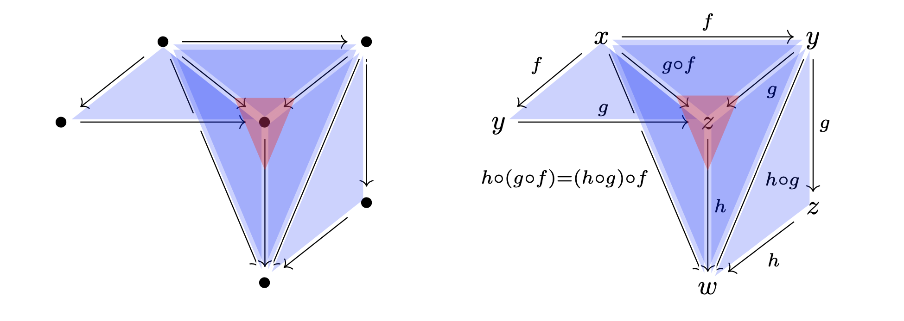

# simple-topes

[](https://fizruk.github.io/simple-topes/)
[](https://fizruk.github.io/simple-topes/haddock/index.html)
[](https://github.com/fizruk/simple-topes/actions/workflows/haskell.yml)

Simple theorem prover for the tope layer of Riehl and Shulman type theory with shapes (RSTT) [1].

[](https://fizruk.github.io/simple-topes/?snippet=--%20%7C%20The%20strict%20interval%20cube%20%28see%20RS17%20Section%203.1%29.%0Acube%20%F0%9D%9F%9A%20with%0A%20%20point%20%F0%9D%9F%AC%20--%20%5E%20%F0%9D%9F%AC%20point%20%28left%20point%29.%0A%20%20point%20%F0%9D%9F%AD%20--%20%5E%20%F0%9D%9F%AD%20point%20%28right%20point%29.%0A%0A--%20%7C%20Inequality%20tope%20%28%E2%89%A4%29%20for%20the%20strict%20interval%20cube%20%F0%9D%9F%9A.%0A--%20NOTE%3A%20the%20order%20of%20the%20rules%20affects%20the%20proof%20search%21%0Atope%20%E2%89%A4%28%F0%9D%9F%9A%2C%20%F0%9D%9F%9A%29%20with%0A%20%20rule%20%22%28%E2%89%A4%29%20distinct%22%20where%0A%20%20%20%20%E2%80%94%E2%80%94%E2%80%94%E2%80%94%E2%80%94%E2%80%94%E2%80%94%E2%80%94%E2%80%94%E2%80%94%E2%80%94%E2%80%94%E2%80%94%0A%20%20%20%20%E2%8B%85%20%7C%20%F0%9D%9F%AC%20%E2%89%A1%20%F0%9D%9F%AD%20%E2%8A%A2%20%E2%8A%A5%0A%0A%20%20rule%20%22%28%E2%89%A4%29%20antisymmetry%22%20where%0A%20%20%20%20%E2%80%94%E2%80%94%E2%80%94%E2%80%94%E2%80%94%E2%80%94%E2%80%94%E2%80%94%E2%80%94%E2%80%94%E2%80%94%E2%80%94%E2%80%94%E2%80%94%E2%80%94%E2%80%94%E2%80%94%E2%80%94%E2%80%94%E2%80%94%E2%80%94%E2%80%94%E2%80%94%E2%80%94%E2%80%94%E2%80%94%E2%80%94%E2%80%94%E2%80%94%E2%80%94%E2%80%94%E2%80%94%E2%80%94%E2%80%94%E2%80%94%E2%80%94%E2%80%94%E2%80%94%E2%80%94%0A%20%20%20%20t%20%3A%20%F0%9D%9F%9A%2C%20s%20%3A%20%F0%9D%9F%9A%20%7C%20%E2%89%A4%28t%2C%20s%29%2C%20%E2%89%A4%28s%2C%20t%29%20%E2%8A%A2%20s%20%E2%89%A1%20t%0A%0A%20%20rule%20%22%28%E2%89%A4%29%20transitivity%22%20where%0A%20%20%20%20%E2%80%94%E2%80%94%E2%80%94%E2%80%94%E2%80%94%E2%80%94%E2%80%94%E2%80%94%E2%80%94%E2%80%94%E2%80%94%E2%80%94%E2%80%94%E2%80%94%E2%80%94%E2%80%94%E2%80%94%E2%80%94%E2%80%94%E2%80%94%E2%80%94%E2%80%94%E2%80%94%E2%80%94%E2%80%94%E2%80%94%E2%80%94%E2%80%94%E2%80%94%E2%80%94%E2%80%94%E2%80%94%E2%80%94%E2%80%94%E2%80%94%E2%80%94%E2%80%94%E2%80%94%E2%80%94%E2%80%94%E2%80%94%E2%80%94%E2%80%94%E2%80%94%E2%80%94%E2%80%94%E2%80%94%E2%80%94%0A%20%20%20%20t%20%3A%20%F0%9D%9F%9A%2C%20s%20%3A%20%F0%9D%9F%9A%2C%20u%20%3A%20%F0%9D%9F%9A%20%7C%20%E2%89%A4%28t%2C%20s%29%2C%20%E2%89%A4%28s%2C%20u%29%20%E2%8A%A2%20%E2%89%A4%28t%2C%20u%29%0A%0A%20%20rule%20%22%28%E2%89%A4%29%20one%22%20where%0A%20%20%20%20%E2%80%94%E2%80%94%E2%80%94%E2%80%94%E2%80%94%E2%80%94%E2%80%94%E2%80%94%E2%80%94%E2%80%94%E2%80%94%E2%80%94%E2%80%94%E2%80%94%E2%80%94%E2%80%94%E2%80%94%E2%80%94%E2%80%94%0A%20%20%20%20t%20%3A%20%F0%9D%9F%9A%20%7C%20%E2%8B%85%20%E2%8A%A2%20%E2%89%A4%28t%2C%20%F0%9D%9F%AD%29%0A%0A%20%20--%20more%20rules%20...%0A%0Aprove%0A%20%20t%20%3A%20%F0%9D%9F%9A%2C%20s%20%3A%20%F0%9D%9F%9A%20%7C%20%E2%89%A4%28t%2C%20%F0%9D%9F%AC%29%2C%20%E2%89%A4%28%F0%9D%9F%AD%2C%20t%29%20%E2%8A%A2%20t%20%E2%89%A1%20s%0A)

## About

This is an experimental project, related to [rzk](https://github.com/fizruk/rzk) proof assistant.
The tope layer in RSTT serves as a tool to specify higher-dimensional diagrams (in particular for (∞,1)-categories, see e.g. [«∞-Category Theory for Undergraduates» talk by Emily Riehl](https://youtu.be/A6hXn6QCu0k), specifically Act II, for an explanation).
However, it appears that in practice (at least for the proofs in RSTT)
statements about topes are fairly straightforward and should __always__ be solved automatically.
Moreover, it seems that the prover need not be very efficient either, since the proof search space is supposed to be relatively small.

One complication, however, is that users can define their own cubes, points, topes, together with their own tope axioms.
These new rules should not complicate matters too much, but I have yet to figure out what assumptions are safe to make about user-defined axioms.

Once stable, this implementation will likely be incorporated into [rzk](https://github.com/fizruk/rzk) proof assistant.

## Usage

### Generating LaTeX for simplicial shapes

Current version supports rendering for 2D and 3D shapes in LaTeX. For example:

```
render latex { ⟨t, s⟩ : 𝟚 × 𝟚 | ≤(s, t) }
render latex { ⟨t1, ⟨t2, t3⟩⟩ : 𝟚 × (𝟚 × 𝟚) | ≤(t2, t1) ∧ ≤(t1, t3)  }
```

Please, note that names for point variables are fixed due to limitations in the implementation.

The generated code relies of `tikz-cd` package:

```tex
\usepackage{tikz-cd}
```

Here is an example of a non-trivial tope, generated LaTeX, its rendering, and a hand-modified version with labels on vertices and edges:

```
render latex { ⟨t1, ⟨t2, t3⟩⟩ : 𝟚 × (𝟚 × 𝟚) | ≤(t2, t3) ∧ ≤(t3, t1) ∨ t1 ≡ 𝟭 ∨ t2 ≡ 𝟬 }
```



```tex
% diagram for the shape
% { ⟨ t1, ⟨ t2, t3 ⟩ ⟩ : 𝟚 × (𝟚 × 𝟚) | ≤ (t2, t3) ∧ ≤ (t3, t1) ∨ t1 ≡ 𝟭 () ∨ t2 ≡ 𝟬 () }
\begin{tikzcd}[
 execute at end picture={
\fill[blue, opacity=0.2, transform canvas={scale around={0.9:(barycentric cs:p000=0.5,p001=0.5,p101=0.5)}}] (p000.center) -- (p001.center) -- (p101.center) -- cycle;
\fill[blue, opacity=0.2, transform canvas={scale around={0.9:(barycentric cs:p000=0.5,p100=0.5,p101=0.5)}}] (p000.center) -- (p100.center) -- (p101.center) -- cycle;
\fill[blue, opacity=0.2, transform canvas={scale around={0.9:(barycentric cs:p001=0.5,p011=0.5,p111=0.5)}}] (p001.center) -- (p011.center) -- (p111.center) -- cycle;
\fill[blue, opacity=0.2, transform canvas={scale around={0.9:(barycentric cs:p001=0.5,p101=0.5,p111=0.5)}}] (p001.center) -- (p101.center) -- (p111.center) -- cycle;
\fill[blue, opacity=0.2, transform canvas={scale around={0.9:(barycentric cs:p000=0.5,p001=0.5,p111=0.5)}}] (p000.center) -- (p001.center) -- (p111.center) -- cycle;
\fill[blue, opacity=0.2, transform canvas={scale around={0.9:(barycentric cs:p000=0.5,p101=0.5,p111=0.5)}}] (p000.center) -- (p101.center) -- (p111.center) -- cycle;
\fill[red, opacity=0.2, transform canvas={scale around={0.3:(barycentric cs:p000=0.5,p001=0.5,p101=0.5,p111=0.5)}}] (p000.center) -- (p001.center) -- (p101.center) -- cycle;
\fill[red, opacity=0.2, transform canvas={scale around={0.3:(barycentric cs:p000=0.5,p001=0.5,p111=0.5,p101=0.5)}}] (p000.center) -- (p001.center) -- (p111.center) -- cycle;
\fill[red, opacity=0.2, transform canvas={scale around={0.3:(barycentric cs:p000=0.5,p101=0.5,p111=0.5,p001=0.5)}}] (p000.center) -- (p101.center) -- (p111.center) -- cycle;
\fill[red, opacity=0.2, transform canvas={scale around={0.3:(barycentric cs:p001=0.5,p101=0.5,p111=0.5,p000=0.5)}}] (p001.center) -- (p101.center) -- (p111.center) -- cycle;
 }]
\;& |[alias=p000]|\bullet& \; & |[alias=p001]|\bullet\\
|[alias=p100]|\bullet& \; & |[alias=p101]|\bullet& \; \\
\;& |[alias=p010]|\;& \; & |[alias=p011]|\bullet\\
|[alias=p110]|\;& \; & |[alias=p111]|\bullet& \; \\
\arrow[from=p000, to=p001]
\arrow[from=p001, to=p011]
\arrow[from=p000, to=p100]
\arrow[from=p011, to=p111]
\arrow[from=p000, to=p111, crossing over]
\arrow[from=p000, to=p101]
\arrow[from=p001, to=p111, crossing over]
\arrow[from=p001, to=p101]
\arrow[from=p100, to=p101, crossing over]
\arrow[from=p101, to=p111, crossing over]
\end{tikzcd}
```

## Development

The project is developed with both Stack and Nix (for GHCJS version).

### Building with GHC

For quick local development and testing it is recommended to work with a GHC version, using [Stack tool](https://docs.haskellstack.org/en/stable/README/). Clone this project and simply run `stack build`:

```sh
git clone git@github.com:fizruk/simple-topes.git
cd simple-topes
stack build
```

The build provides an executable `simple-topes` which can be used to run theorem prover on a file:

```sh
stack exec -- simple-topes < FILE
```

To build (if needed) and run executable, use `stack run`:

```sh
stack run < FILE
```

### Building with GHCJS

`try-simple-topes` package is designed to be compiled using GHCJS for an in-browser version of the theorem prover.
To build this package you need to use [Nix](https://nixos.org/nix).
It is recommended that you use [Cachix](https://www.cachix.org) to avoid recompiling lots of dependencies, especially [Miso](https://haskell-miso.org):

```sh
# Install Nix
curl https://nixos.org/nix/install | sh
# (optionally) Install Cachix
nix-env -iA cachix -f https://cachix.org/api/v1/install
# (optionally) Use cached miso from Cachix
cachix use miso-haskell
```

Clone the repository, enter `try-simple-topes` directory and use `nix-build`:
```sh
git clone git@github.com:fizruk/simple-topes.git
cd simple-topes/try-simple-topes
nix-build
```

Now open `index.html` to see the result. Note that if local GHCJS build results are unavailable, `index.html` will use the [JS file from GitHub Pages](https://fizruk.github.io/rzk/result/bin/try-simple-topes.jsexe/all.js) as a fallback.

# References

1.  Emily Riehl and Michael Shulman. __A type theory for synthetic ∞-categories.__ _Higher Structures, 1, 2017._ https://arxiv.org/abs/1705.07442
